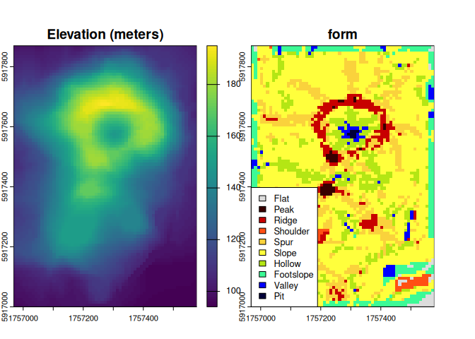
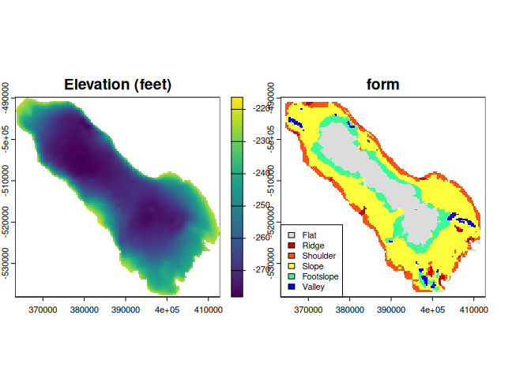

<!-- README.md is generated from README.Rmd. Please edit that file -->

# rgeomorphon

<!-- badges: start -->

[](https://github.com/brownag/rgeomorphon/actions)
[](https://humus.rocks/rgeomorphon/)
<!-- badges: end -->

A fast and low-dependency implementation of the ‘geomorphon’ terrain
form classification algorithm of Jasiewicz and Stepinski (2013) based
largely on the ‘GRASS GIS’ ‘r.geomorphon’ module.

This implementation employs a novel parallel algorithm, written in C++
and without external dependencies.

For the sake of simplicity, some GRASS-specific implementation details
have not been added. See `?geomorphons` for details.

## Installation

You can install the development version of {rgeomorphon} like so:

``` r
# install.packages("remotes")
remotes::install_github("brownag/rgeomorphon")
```

## Volcano Example

This is a basic example using the classic R `volcano` dataset and
{terra} SpatRaster object as input.

`volcano` is a 10m by 10m grid of elevation values from Maunga Whau in
the Auckland volcanic field of New Zealand.

``` r
library(terra)
#> terra 1.8.56
library(rgeomorphon)

# PARAMETERS
SEARCH = 7       # outer search radius (cells)
SKIP = 0         # inner skip radius (cells)
FLAT = 1         # flat angle threshold (degrees)

# classic volcano elevation data
data("volcano", package = "datasets")

# construct and georeference a SpatRaster object
dem <- terra::rast(volcano)
terra::crs(dem) <- terra::crs("EPSG:2193")
terra::ext(dem) <- c(1756968, 1757578, 5917000, 5917870)
names(dem) <- "Elevation (meters)"

# calculate geomorphons "forms"
system.time({
    rg <- geomorphons(
        dem,
        search = SEARCH,
        skip = SKIP,
        flat = FLAT
    )
})
#>    user  system elapsed 
#>   0.146   0.004   0.145

# inspect result
plot(c(dem, rg), 
     plg = list(x = "bottomleft", 
                bty = "o", 
                bg = "white"))
```



## Salton Sea Example

Now we will do a bathymetry example using the built in Salton Sea
dataset (`salton`).

See `help("salton")` for details.

``` r
library(terra)
library(rgeomorphon)

# PARAMETERS
SEARCH = 10      # outer search radius (cells)
SKIP = 3         # inner skip radius (cells)
FLAT = 0.1       # flat angle threshold (degrees)

# salton sea bathymetry sample data
data("salton", package = "rgeomorphon")

# construct and georeference a SpatRaster object
dem <- terra::rast(salton)
terra::crs(dem) <- attr(salton, "crs")
terra::ext(dem) <- attr(salton, "extent")
names(dem) <- "Elevation (feet)"

# calculate bathymorphons using 6-form system
system.time({
    rg <- geomorphons(
        dem,
        search = SEARCH,
        skip = SKIP,
        flat = FLAT,
        forms = "forms6"
    )
})
#>    user  system elapsed 
#>   0.179   0.003   0.165

# inspect result
plot(c(dem, rg), 
     plg = list(x = "bottomleft", 
                bty = "o", 
                bg = "white",
                cex = 0.85))
```



# Citation

``` r
citation("rgeomorphon")
#> To cite package 'rgeomorphon' in publications use:
#> 
#>   Brown A (2025). _rgeomorphon: A Lightweight Implementation of the
#>   'Geomorphon' Algorithm_. R package version 0.1.0,
#>   <https://github.com/brownag/rgeomorphon/>.
#> 
#>   Jasiewicz J, Stepinski T (2013). "Geomorphons - a pattern recognition
#>   approach to classification and mapping of landforms."
#>   _Geomorphology_, *182*, 147-156. doi:10.1016/j.geomorph.2012.11.005
#>   <https://doi.org/10.1016/j.geomorph.2012.11.005>.
#> 
#>   Jasiewicz J, Stepinski T, GRASS Development Team (2024). _Geographic
#>   Resources Analysis Support System (GRASS) Software, Version 8.3_.
#>   Open Source Geospatial Foundation, USA. r.geomorphon module,
#>   <https://grass.osgeo.org/grass-stable/manuals/r.geomorphon.html>.
#> 
#> To see these entries in BibTeX format, use 'print(<citation>,
#> bibtex=TRUE)', 'toBibtex(.)', or set
#> 'options(citation.bibtex.max=999)'.
```
